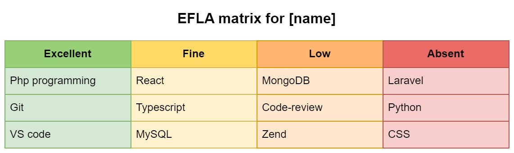

# How to ask for a raise with the EFLA matrix

EFLA stands for **Excellent, Fine, Low, Absent**. This method is similar to a SWOT (strengths, weaknesses, opportunities, and threats) analysis often used in Business Analysis. However, with EFLA, you evaluate skills of a person. It can be you, or a subordinate, for example.

1. To perform the analysis, first, **assemble a list of competencies** that are either essential for your position or your employer wants to see.

2. Once you have made a list, **analyze your skillset** with questions using the EFLA matrix:

-   E (Excellent) - which competencies are your strongest?
-   F (Fine) – which are developed well, but require additional knowledge?
-   L (Low) – which are developed weakly and require additional training?
-   A (Absent) – which are not developed at all and require learning from scratch?

3. Act.

-   If your competencies are sufficiently developed, now you can ask your manager for a raise or salary increase using the matrix as an argument in your favor.
-   If the analysis shows that you need to improve your skills, create a development plan, coordinate it with your supervisor on the next one-to-one meeting, and move forward with it. This way, you will have clear steps to achieve your career goals, and it will be easier for you to follow the plan.

In conclusion, the EFLA method is one way of visual representation of your skillset as a candidate that helps you evaluate your skills and competencies before asking for a raise or salary increase.

Source: https://t.me/sb8blog/523